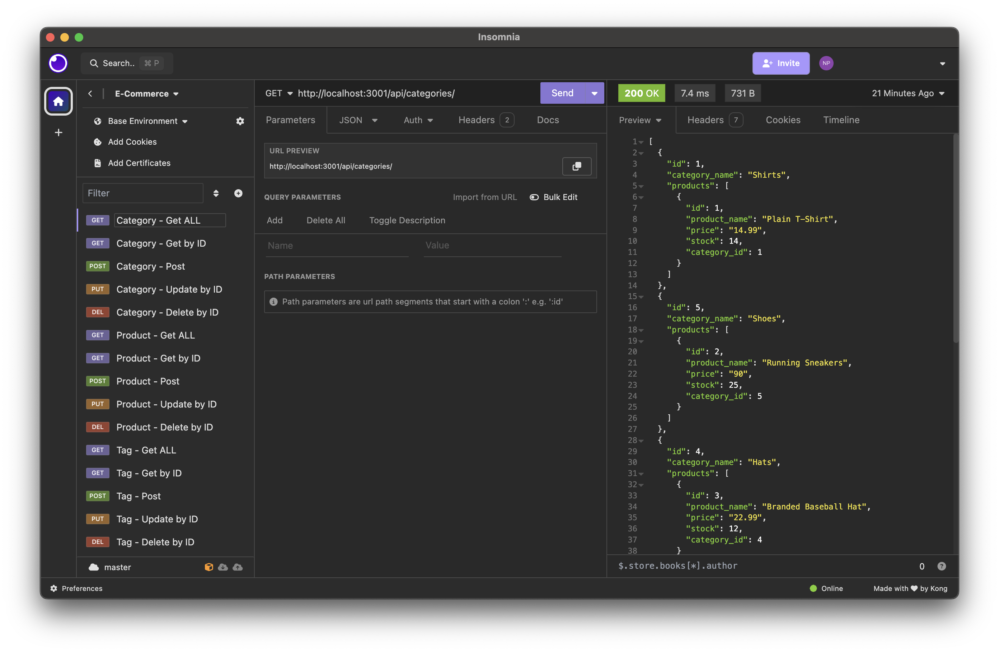
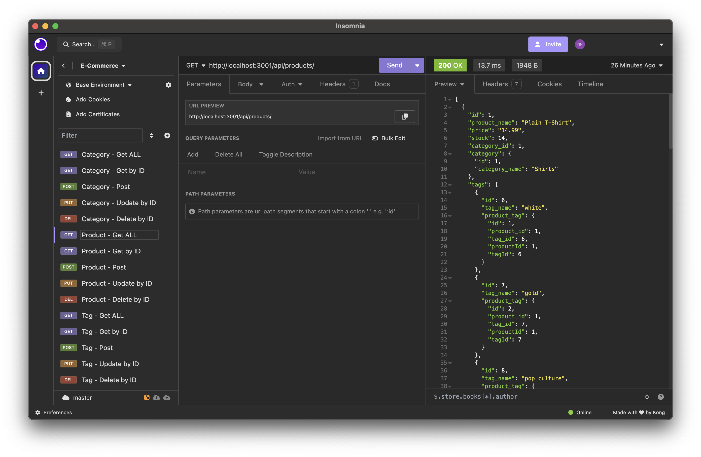
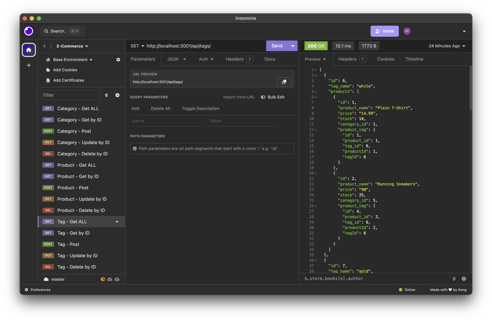

# Challenge 13

## E-Commerce Back End

In this project I have configured the db to connect with sequelize. Using models to make tables, loading seeds and connecting api routes.

## Link

https://drive.google.com/file/d/1SyXbldR-iPamhVBYK93tNSFwQvueLSJs/view?usp=sharing

## Screenshots (Images are also links to video)

### Category API

### Product API

### Tag API

